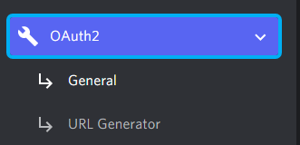
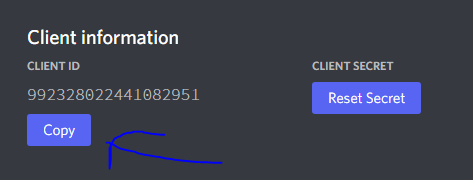
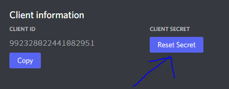
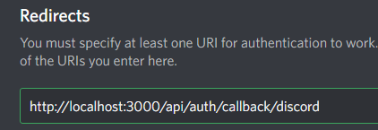
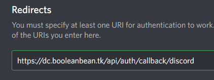

## Discord Bot Dashboard

### To Do

-  Write TODO
-  Make a middleware or ProtectedContent page to check session status for `dashboard` routes
-  Make a guild selector page

### Development

-  Clone the repo.
-  Run `yarn install` or `yarn` command to start installing dependencies.

   -  While installing dependencies let's setup environment keys.
      1. Rename `.env.development.example` to `.env.development`.
      2. Setup `NEXT_PUBLIC_DOMAIN`:
         -  Value: `http://localhost:3000`
      3. Setup `NEXTAUTH_URL`:
         -  Value: `http://localhost:3000`
      4. Setup `NEXTAUTH_SECRET`
         -  Value: Generate a secret key and define it
      5. Setup `DISCORD_APP_ID` and `DISCORD_APP_SECRET`
         -  Go [Discord Developers](https://discord.com/developers/applications) website
         -  Generate a new application
         -  Click `OAuth2` button and select `General`
         1. 
         -  Click `Copy` button and define it for `DISCORD_APP_ID`
         2. 
         -  Click `Reset Secret` button, copy it and define it for `DISCORD_APP_SECRET`
         3. 

-  Setup `Redirects` for Discord App
   1. Go [Discord Developers](https://discord.com/developers/applications) website and select the app
   2. Click `Add Redirect` button
   3. Type `http://localhost:3000/api/auth/callback/discord`
      1. 
   4. Click `Save Changes` button at the bottom of the page that shown
-  Finally run `yarn dev` command to start dev server.

### Production

-  Clone the repo.
-  Run `yarn install` or `yarn` command to start installing dependencies.
   -  While installing dependencies let's setup environment keys.
      1. Rename `.env.production.example` to `.env.production`.
      2. Setup `NEXT_PUBLIC_DOMAIN`:
         -  Value: `https://<domain>.com`
      3. Setup `NEXTAUTH_URL`:
         -  Value: `https://<domain>.com`
      4. Setup `NEXTAUTH_SECRET`
         -  Value: Generate a secret key and define it
      5. Setup `DISCORD_APP_ID` and `DISCORD_APP_SECRET`
         -  Go [Discord Developers](https://discord.com/developers/applications) website
         -  Generate a new application
         -  Click `OAuth2` button and select `General`
         1. 
         -  Click `Copy` button and define it for `DISCORD_APP_ID`
         2. 
         -  Click `Reset Secret` button, copy it and define it for `DISCORD_APP_SECRET`
         3. 
   -  Setup `Redirects` for Discord App
      1. Go [Discord Developers](https://discord.com/developers/applications) website and select the app
      2. Click `Add Redirect` button
      3. Type `https://<domain>.com/api/auth/callback/discord`
         1. 
      4. Click `Save Changes` button at the bottom of the page that shown
-  Run `yarn build` command to build optimized version for production.
   _\*you should run `yarn lint:fix` to fix eslint errors before building the app_
-  Finally run `yarn start` command to start for production

### Credits

-  [Template](https://github.com/theodorusclarence/ts-nextjs-tailwind-starter)

### License

This project is licensed under the `GNU General Public License 3.0`.
